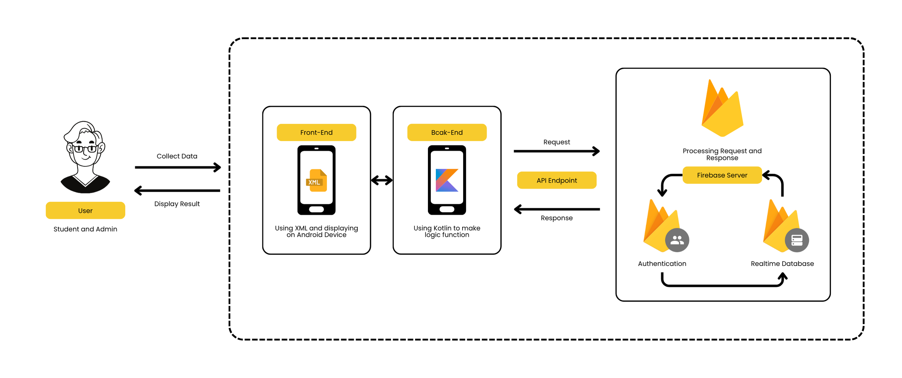

# TeknoVaris: Inventory Lending Management System


An Android-based application for managing and tracking asset items at the Faculty of Engineering, University of Riau. Designed to address asset loss issues, inaccurate lending data, and weak identity verification present in the current manual system. This application integrates with the Faculty of Engineering student database to ensure that borrowing is only done by authorized academic community members.

### **Project Team:**

| Name                     | Student ID |
| ------------------------ | ---------- |
| Agus Syuhada             | 2207125092 |
| Ahmadi Ihsan Ananda      | 2207113380 |
| Danil Zalma Hendra Putra | 2207112600 |
| Edi Putra Yuni           | 2207111395 |
| Rally Mizanur            | 2207111392 |
| Rayhan Al Farassy        | 2207135776 |
| Zacky Julio Putra        | 2207135753 |

## 🚀 Features

- **Barcode-Based Inventory Lending**: Lending system with identity verification through barcode scanning for security and data accuracy
- **Integrated Login System & Real-Time Database**: Login system integrated with student and faculty databases with real-time data updates
- **Location Tracking & Timer Reminder**: Tracking of device's last location and automatic reminder system for return deadlines

## 🏗️ App Architecture



## 🔍 Project Scope

### 📱 Mobile Application Development

- **Advanced Lending Management**: Comprehensive tracking of borrower details, lending dates, and item conditions
- **Multi-Level Authentication**: Integrated verification system ensuring only authorized faculty members can access
- **Real-Time Synchronization**: Live updates across all connected devices and admin panels
- **Intuitive User Interface**: Clean, modern design optimized for both student and admin workflows

### 💾 Database & Backend Infrastructure

- **Firebase Real-Time Database**: Scalable cloud database with instant synchronization
- **Secure Authentication System**: Multi-layer security with encrypted user data
- **Analytics Dashboard**: Usage statistics and system performance monitoring

### ⚙️ Advanced Features

- **Smart Notifications**: Contextual reminders and status updates
- **GPS Integration**: Location-based services for item tracking

## 🛠️ Tech Stack

### Frontend

- **Android Studio** - Primary IDE for Android development
- **Java/Kotlin** - Programming languages
- **XML** - UI layout design
- **Material Design** - UI/UX components

### Backend & Database

- **Firebase Realtime Database** - Real-time data synchronization
- **Firebase Authentication** - User authentication and management

### Libraries & APIs

- **CameraX** - Camera functionality and image capture
- **MLKit Barcode Scanner** - Barcode scanning
- **Google Play Services** - Location services and authentication
- **Lottie Animation** - Displays lightweight, vector-based animations
- **MVVM** - Architecture pattern for separation of concerns and easier state management

### Security & Performance

- **Firebase Security Rules** - Database access control

## 📲 Installation

### Prerequisites

- Android device with API level 21+ (Android 5.0 Lollipop)
- Internet connection for real-time features
- Camera permission for barcode scanning
- Location permission for tracking features
- Alarm Notifaction for reminder

### Download Options

#### Option 1: APK Download

```bash
# Download the latest APK from releases
wget https://github.com/rayhanfay/pplm-project/releases/latest/download/TeknoVaris.apk

# Install using ADB (if connected to computer)
adb install TeknoVaris.apk
```

#### Option 2: Build from Source

```bash
# Clone the repository
git clone https://github.com/rayhanfay/pplm-project.git

# Open in Android Studio
cd pplm-project
# Open project in Android Studio and build
```

### First-Time Setup

1. **Download and Install** the APK on your Android device
2. **Grant Permissions** when prompted (Camera, Location, Storage)
3. **Complete Onboarding** process to understand app features
4. **Login** with your faculty credentials
5. **Update Password** if logging in for the first time
6. **Verify Phone Number** for borrowing services

## 🎯 Usage

### For Students

1. **Login** with your student credentials
2. **Browse Available Items** in the student dashboard
3. **Scan barcode** of desired item
4. **Fill Lending Form** with required details
5. **Set Lending Duration** according to your needs
6. **Submit Borrowing** to confirm borrow

### For Administrators

1. **Login** with admin credentials
2. **Monitoring Item and Borrowing Status** in admin dashboard
3. **Manage Inventory** - add, edit, or remove items
4. **Process Returns** using barcode scanner

### Barcode Operations

- **Lending**: Student Scan item barcode to initiate lending process
- **Returning**: Adminstrator Scan same barcode to process return
- **Inventory**: Each item has unique bardcode for tracking

## 🔐 Environment Setup

### 1. Create `google-services.json`

1. Go to [Firebase Console](https://console.firebase.google.com/)
2. Select or create a new project
3. Add your Android app (use your app's package name)
4. Download the `google-services.json` file
5. Place it in your Android project under:

   ```
   app/google-services.json
   ```

### 2. Firebase Configuration (example `google-services.json` content)

```json
{
  "project_info": {
    "project_number": "123xxxxxxxx",
    "firebase_url": "https://your-project-id.firebaseio.com",
    "project_id": "your-project-id",
    "storage_bucket": "your-project-id.appspot.com"
  },
  "client": [
    {
      "client_info": {
        "mobilesdk_app_id": "1:123456789012:android:abc123def456",
        "android_client_info": {
          "package_name": "com.example.yourapp"
        }
      },
      "api_key": [
        {
          "current_key": "AIzaSyXXXXXXX"
        }
      ]
    }
  ],
  "configuration_version": "1x"
}
```

> ⚠️ Replace placeholders with actual values from your Firebase project.

### 3. Integrate Firebase into Android Project

#### Using Groovy (default):

**In `build.gradle (Project)`**:

```gradle
buildscript {
    dependencies {
        classpath 'com.google.gms:google-services:4.3.15'
    }
}
```

**In `build.gradle (App)`**:

```gradle
plugins {
    id 'com.android.application'
    id 'com.google.gms.google-services'
}
```

#### Using Kotlin DSL (`build.gradle.kts`):

**In `build.gradle.kts (Project)`**:

```kotlin
buildscript {
    dependencies {
        classpath("com.google.gms:google-services:4.3.15")
    }
}
```

**In `build.gradle.kts (App)`**:

```kotlin
plugins {
    id("com.android.application")
    id("com.google.gms.google-services")
}
```

## 📂 Dummy Data

### User

| Username     | Password      | Role      |
| ------------ | ------------- | --------- |
| 1234         | 12345678      | Student   |
| 4321         | 12345678      | Admin     |

### Item


| Item ID      | Item Name    | Item Status  | Item Type   | Item Description |
| ------------ | ------------ | ------------ | ----------- | ---------------- |
| 010102012023 | Remote TV LG | Tersedia     | Remote      | Remote TV merek LG untuk keperluan presentasi di ruang kelas |
